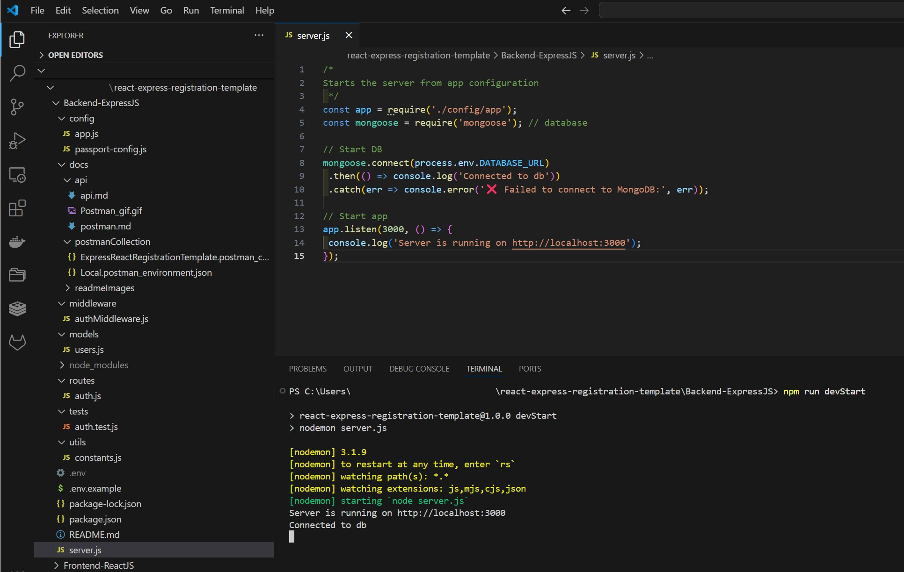
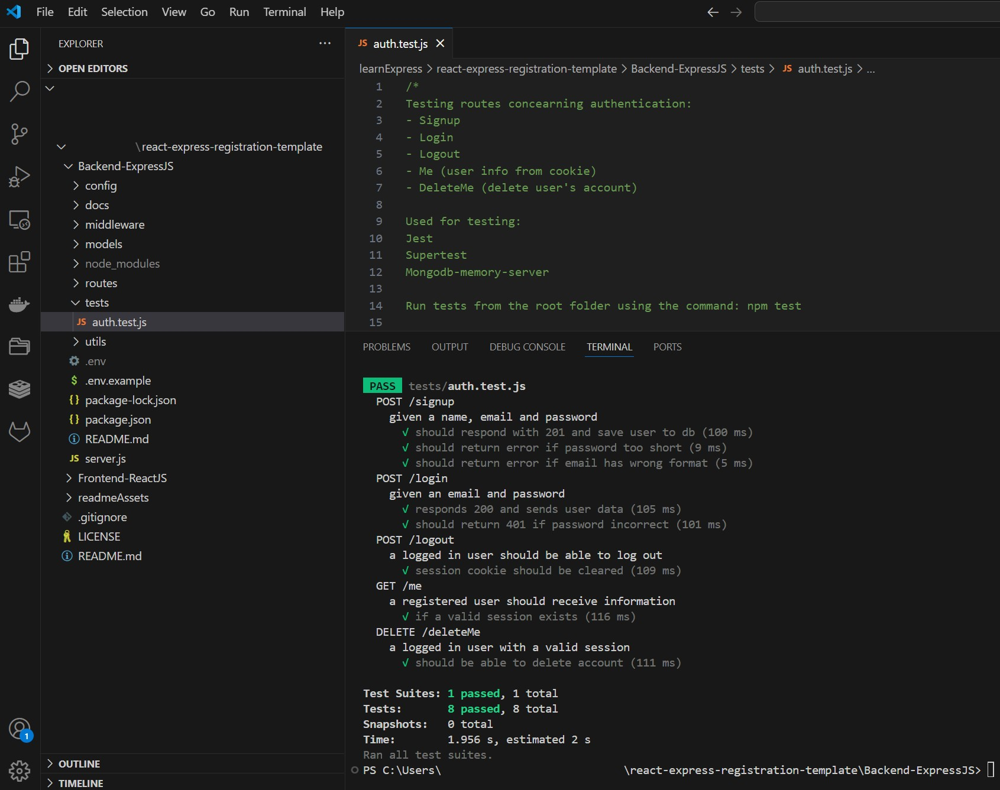
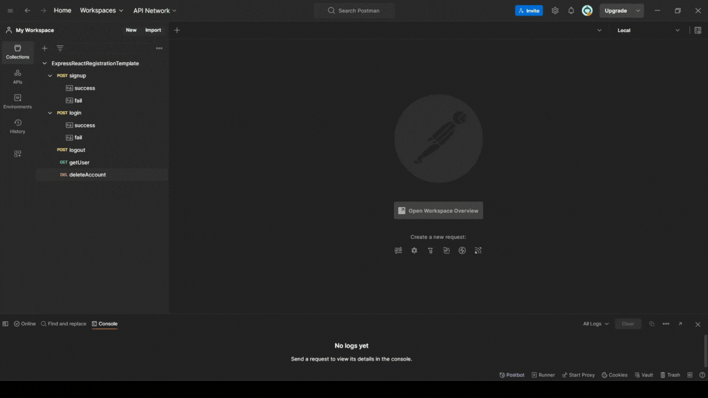

<div align="center">
  <br>
  <h1><b>Express App Registration Template</b></h1>
  <strong>Express JS + MongoDB Back-end</strong>
</div>
<br>

<hr>


<hr>

# Table of Contents
- [Introduction](#introduction)
- [Installation](#installation)
- [Code and organization](#code-and-organization)
- [Api dococumentation](#api-documentation)
- [Testing](#testing)
- [The App](#the-app)
- [About and license](#about-and-license)
- [Versioning and external resources](#versioning-and-external-resources)
<br>

# Introduction

An  Express JS and MongoDB backend template with signup and login functionality built with Express JS and MongoDB.

This project contains the following back-end logic:
- Signup route
- Login route
- Logout rote
- Get user route (gets user's information from cookie and sends it)
- Delete account route

This project is using the following extensions:
- bcrypt for password hashing
- passport for authentication (local version)
- express-session for session management
- connect-mongo to use Mongodb for sesion storage
- cors to use server-side sessions
- jest, supertest, and Mongodb-memory-server for testing

# Installation

<details>
   <summary>1. Clone this repository</summary>

   >\
   > More information on how to clone this repository [available here](https://docs.github.com/en/repositories/creating-and-managing-repositories/cloning-a-repository)
   ><br/><br/>
</details>

<details>
   <summary>2. Install dependencies</summary>

   >\
   > Make sure you have MongoDB installed in your machine. If you do not, I recommend using the MongoDB Community Server Download [available here](https://www.mongodb.com/try/download/community). (Date: 24 March 2025). You should also have NodeJS installed.
   > Next, install the app dependencies:
   >\
   > ```pwsh
   >npm install
   >```
   ><br/><br/>
</details>

<details>
   <summary>3. Create an env file</summary>

   >\
   > You can create a .env file in the root, the content should be similar to that of the .env.example file provided.
   > 
   > Do not forget to change the session secret key.
   ><br/><br/>
</details>

<details>
   <summary>4. Run the app</summary>

   >\
   > ```pwsh
   >npm run devStart
   >```
   ><br/><br/>
</details>
<br/>

# Code and organization

This is a small project, with a standard folder structure.

## server.js

Is the entry point of the app.
It contains the database connection, and starts the server with the imported app configuration.

## config

App.js contains the main app configurations.
Passport-config.js contains the configuration for the 'passport' extension, which handles user authorization.

## docs

Contains the documentation for the apis and postman collection.
See the [api documentation](#api-documentation) section for more details.

## middleware
Contains authentication middleware functions used in the routes to check whether a user is authenticated or not.

## models
Contains the User schema db model.

## routes

All routes are contained in the file called `auth.js`. 

## tests

Contains only one test file with basic test cases. More information about testing available [here](#testing).  

## utils

Contains the file `contants.js` which contains constant values to define the length of expected inputs (such as email and password).
Note an almost identical version also exists in the Frontend project folder (consumed by the React App only).
If you are using both the front- and back-end templates to build your project, remeber to either share a file between both or make changes to both files should these constants need to change.

# Testing

In the `test` directory, the file `auth.test.js` contains both the testing configuration as well as tests for each route provided.
Testing uses jest, supertest, and Mongodb-memory-server. 

It can be run from the root folder with the following command:

```pwsh
npm test
```



# Api documentation

In the `docs` directory you will find the following:

## api directory
`api` includes:
- `api.md` which documents sample payloads and responses for each route
- `postman.md` which documents how to use postman to test the app's routes and how to use the files inside `postmanCollection`

## postmanCollection
the folder includes:
- `ExpressReactRegistrationTemplate.postman_collection.json` — Postman collection with all requests
- `Local.postman_environment.json` — (Optional) Sample environment variables



## readmeImages
the folder contains images displayed in this README.md file.

# The App

The app contains basic registration functionality to be used as a starter template in other Fullstack or Express JS projects.

It uses server-side cookies (with express-session), manages authorization (using passport), and saves user registration information (with hashed passwords) to a mongoDB database.

## App versions

This is the project's version 3.

Main difference between this version the previous versions:
- no use of templates: 'views' and 'public' folder have been removed, along with routes displaying express js templates. This version's UI is in React JS.
- testing: testing changed accordingly (given json responses) and new tests implemented (previously only signup and login routes were tested)
- routes: routes have been adapted, and a new route (to get user information) was implemented
- postman: collections have been added to test the routes using postman

# About and license

This is the third draft of an app template in React/Express. This directory concearns itself with the express js backend.

This is a personal project completed by the author, which you are welcome to use and modify at your discretion.

# Versioning and external resources

Version 1 of this project had a skeleton based on a web tutorial from Kyle's Web Dev Simplified video [available here](https://www.youtube.com/watch?v=-RCnNyD0L-s), which is great for beginners in Node JS/ Express JS. Errors do not use flash, and the routes had slight adjustments. It then improved on the skeleton with proper styling, adjustments to session management and template structure, among others. 

Version 2 built on top of version 1 with database implementation, folder re-structuring, introduction of testing, and slight improvements in the routes. If you are new to Express JS and MongoDB, there is also a video from Kyle's Web Dev Simplified [available here](https://www.youtube.com/watch?v=fgTGADljAeg&t=1016s) where the basics of schema are presented and can be somewhat helpful. 

If one is new to testing in Express, I recommend an article [available here](https://mayallo.com/unit-integration-e2e-testing-using-jest/)
which is helpful in setting up the testing environment with jest and the mongodb-memory server.

Version 3 had a separation of concearns: the React front-end was implemented, and the Express back-end was re-fractored accordingly.

The Version 1 of this project (in express JS only, with no database, using templates) is available in the branch named `version_1`.
The Version 2 of this project (express JS with mongoDB, using templates) is available in the branch named `version_2`.

