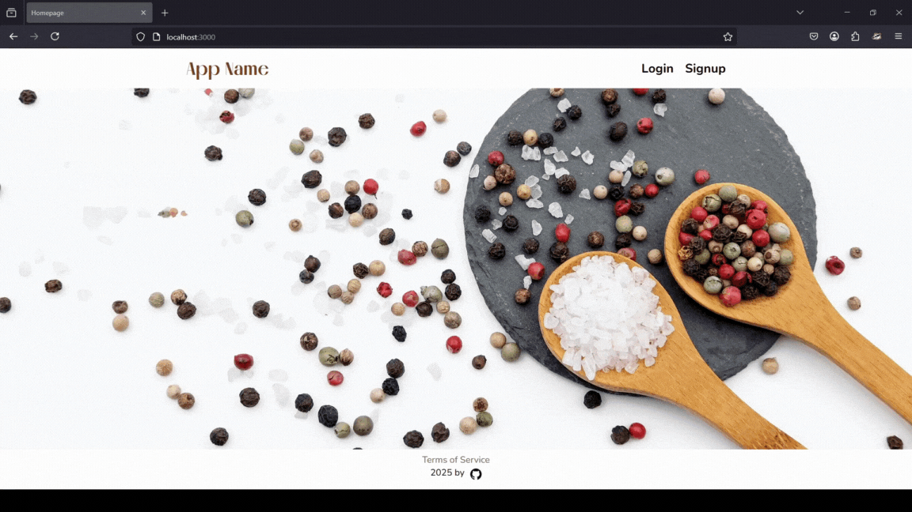

<div align="center">
  <br>
  <h1><b>Express App Registration Template</b></h1>
  <strong>Version 2 (Express JS + MongoDB only)</strong>
</div>
<br>

<hr>


<hr>

# Table of Contents
- [Introduction](#introduction)
- [Installation](#installation)
- [Code and organization](#code-and-organization)
- [The App](#the-app)
- [About and license](#about-and-license)
- [Versioning and external resources](#versioning-and-external-resources)
<br>

# Introduction

A website template with signup and login functionality built with Express JS and MongoDB.

This project contains the base functionality and styling for the following pages:
- Homepage
- Signup page
- Login page
- Dashboard page
- Terms and conditions page
- Logout functionality

This project is using the following extensions:
- bcrypt for password hashing
- passport for authentication (local version)
- express-session for session management
- connect-mongo to use Mongodb for sesion storage
- cors to use server-side sessions
- jest, supertest, and Mongodb-memory-server for testing

# Installation

<details>
   <summary>1. Clone this repository</summary>

   >\
   > More information on how to clone this repository [available here](https://docs.github.com/en/repositories/creating-and-managing-repositories/cloning-a-repository)
   ><br/><br/>
</details>

<details>
   <summary>2. Install dependencies</summary>

   >\
   > Make sure you have MongoDB installed in your machine. If you do not, I recommend using the MongoDB Community Server Download [available here](https://www.mongodb.com/try/download/community). (Date: 24 March 2025). You should also have NodeJS installed.
   > Next, install the app dependencies:
   >\
   > ```pwsh
   >npm install
   >```
   ><br/><br/>
</details>

<details>
   <summary>3. Create an env file</summary>

   >\
   > You can create a .env file in the root, the content should be similar to that of the .env.example file provided.
   > 
   > Do not forget to change the session secret key.
   ><br/><br/>
</details>

<details>
   <summary>4. Run the app</summary>

   >\
   > ```pwsh
   >npm run devStart
   >```
   ><br/><br/>
</details>


# Code and organization

This is a small project, with a standard folder structure.

## Server.js

Is the entry point of the app.
It contains the database connection, and starts the server with the imported app configuration.

## config

App.js contains the main app configurations.
Passport-config.js contains the configuration for the 'passport' extension, which handles user authorization.

## middleware
Contains authentication middleware functions used in the routes to check whether a user is authenticated or not.

## models
Contains the User schema db model.

## public

The `public` directory contains the following folders:

- css: stylesheet files
- fonts: fonts downloaded from fontshare used for styling
- icons: containing icons used for styling
- images: containing images (including the ones displayed in this README file).

## routes

The routes are contained in two files:
- auth.js contains auth-related routes such as signup, login, and logout.
- general.js constains public routes such as homepage and terms and conditions page.

## tests

Contains the main test file which uses jest, supertest, and mongodb memory server. 
It can be run from the root folder with the following command:

```pwsh
npm test
```

## views

The views directory contains the ejs templates used for the UI.
The homepage is in the index.ejs file, while other pages are in the files with their respective names.

It also contains a folder names `partials` with the header and footer templates, which surround the other pages.

The css files are imported in header.ejs.

# The App

The app contains basic registration functionality and placeholder text/image thought to be used as a starter template in other Express JS projects.

It uses server-side cookies (with express-session), manages authorization (using passport), and saves user registration information (with hashed passwords) to a mongoDB database.

## App versions

This is the project's version 2.

Main difference between this version and version 1:
- folder structure: the code has been separated in the new folder structure
- tests: test implementation has been added
- database: version 1 had no database and relied on an array to save users, mongoDB implemented in version 2
- routes: a new route to delete the user's account has been added and better error handling was added to the signup route

## Error handling

Very basic server-side error handling was implemented in the forms.


## Mobile version

Simple syting was added, with the attempt to build the app mobile-fist.
This could certainly be improved, especially given the fact no Javascript code was used in the front-end.


# About and license

This is the first draft of an app template in React/Express. This draft solely uses Express with ejs templates.

This is a personal project completed by the author, which you are welcome to use and modify at your discretion.

# Versioning and external resources

Version 1 of this project had a skeleton based on a web tutorial from Kyle's Web Dev Simplified video [available here](https://www.youtube.com/watch?v=-RCnNyD0L-s), which is great for beginners in Node JS/ Express JS. Errors do not use flash, and the routes had slight adjustments. It then improved on the skeleton with proper styling, adjustments to session management and template structure, among others. 

Version 2 built on top of version 1 with database implementation, folder re-structuring, introduction of testing, and slight improvements in the routes. If you are new to Express JS and MongoDB, there is also a video from Kyle's Web Dev Simplified [available here](https://www.youtube.com/watch?v=fgTGADljAeg&t=1016s) where the basics of schema are presented and can be somewhat helpful. 

If one is new to testing in Express, I recommend an article [available here](https://mayallo.com/unit-integration-e2e-testing-using-jest/)
which is helpful in setting up the testing environment with jest and the mongodb-memory server.

The Version 1 of this project (in express JS only, with no database, using templates) is available in the branch named `version_1`.
The Version 2 of this project (express JS with mongoDB, using templates) is available in the branch named `version_2`.

