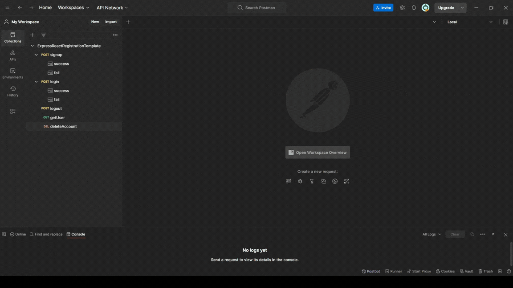

# Postman documentation

This project includes a Postman collection for testing the authentication routes in a local environment.

✅ **What's Included**

`signup`: Registers a new user with random data (`/api/signup`)

`login`: Logs in using the generated credentials (`/api/login`)

`logout`: Logs out the current session (`/api/logout`)

`getUser`: Checks if the user is authenticated (`/api/me`)

`deleteAccount`: Deletes the current user account (`/api/deleteMe`)

📦 **Files**

`ExpressReactRegistrationTemplate.postman_collection.json` — Postman collection with all requests

`Local.postman_environment.json` — (Optional) Sample environment variables

🚀 **How to Use**

1. Import the Collection

- Open Postman

- Go to File → Import

- Select *ExpressReactRegistrationTemplate.postman_collection.json*

2. Set Up the Environment (Optional but Recommended)

- import *Local.postman_environment.json* as provided **or**

- Create a new Postman environment and add:

 Key| Value 
 --- | --- 
 `host` |	`http://localhost:3000` 
 `email` |	`user@example.com` 
 `password` |	`pass123` 

 3. Test the flow

 💡 The signup request auto-generates random credentials and saves them to environment variables for the other requests to use.

 

 ℹ️ **External resources**

 If you are new to Postman, I recommend a short video from TomDoesTech ["Lean Postman in 15 Minutes" available here](https://www.youtube.com/watch?v=ypKHnRmPOUk)

