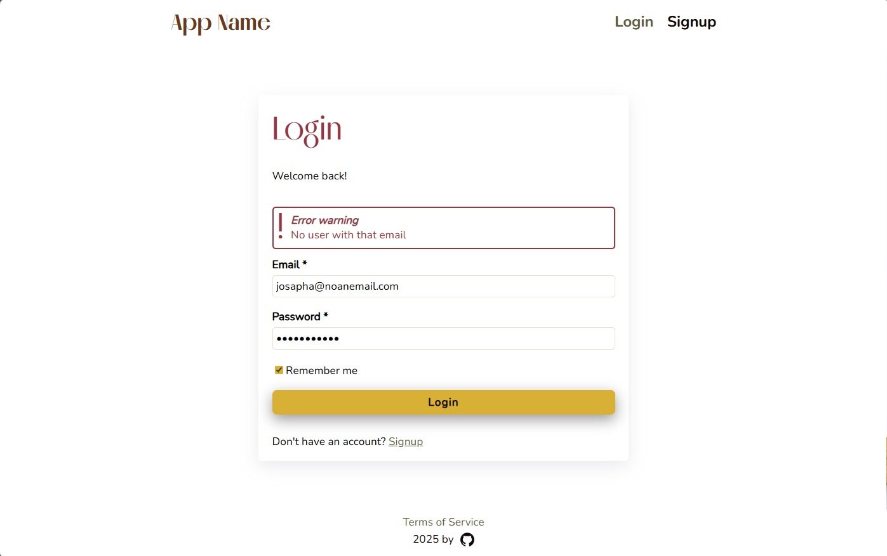
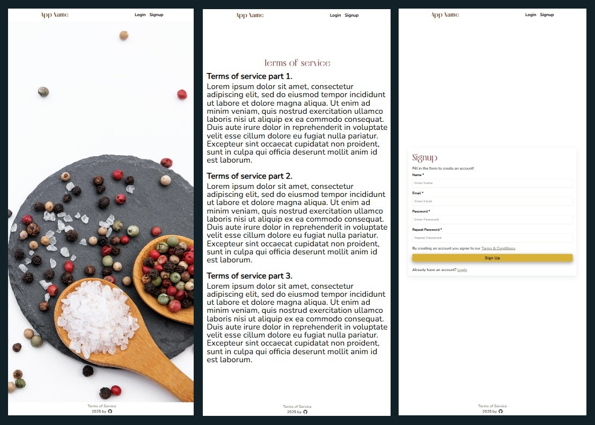

<div align="center">
  <br>
  <h1><b>Express + React App Registration Template</b></h1>
  <strong>React + Vite Front-end</strong>
</div>
<br>

<hr>


<hr>

# Table of Contents
- [Introduction](#introduction)
- [Installation](#installation)
- [Code and organization](#code-and-organization)
- [The App](#the-app)
- [About and license](#about-and-license)
- [Versioning and external resources](#versioning-and-external-resources)
<br>

# Introduction

This is the React frontend for a full-stack registration and authentication app using React with Vite, React Router, and form handling with communication to an Express.js backend. This README file refers specifically to the functioning of the Frontend portion of the application.

This project contains the UI and styling for the following pages:
- Homepage
- Signup page
- Login page
- Dashboard page
- Account deleted page
- Terms and conditions page

Through the Dashboard the user may also:
- Logout
- Delete the account

This project is using the following extensions:
- React Router for routing
- Redux Toolkit for state management
- Axios for HTTP requests
- PropTypes to to validate props

# Installation

<details>
   <summary>1. Clone this repository</summary>

   >\
   > More information on how to clone this repository [available here](https://docs.github.com/en/repositories/creating-and-managing-repositories/cloning-a-repository)
   > then enter the frontend folder using:
   > ```pwsh
   >cd Frontend-ReactJS
   >```
   ><br/><br/>
</details>

<details>
   <summary>2. Install dependencies</summary>

   >\
   > Make sure you have NodeJS installed. You can then proceed to install dependencies with the command:
   >\
   > ```pwsh
   >npm install
   >```
   ><br/><br/>
</details>

<details>
   <summary>3. Run the app</summary>

   >\
   >Start the react app with the command:
   > ```pwsh
   >npm run dev
   >```
   ><br/><br/>
</details>


# Code and organization

The main entry to the application is `main.jsx`, where the main css files are imported, and which will return the Router.

## router

This project uses the React Router library. It creates the App around it in `main.jsx`.
In the `router`directory, you will find the `Router.jsx` component, which imports all app pages and layout components (Header/Footer).

You can read more about the routing implementation used in this application from the documentation accessing the link: [click here](https://reactrouter.com/start/declarative/routing).

The file `ProtectedRoute.jsx` can be used as a wrapper for login-protected pages. It can wrap components in `Routes.jsx` and return the desired page through its `Outlet`.

## apis

Requests to the backend are made using axios. `axios.js` is the axios configuration file.
`apiEndpoints.js`contain the backend's url to which requests should be made. All urls are in this file for ease of maintenance.

`apiHandlers` is a folder containing a file for each endpoint through which requests are sent to the backend. Functions in these files are called by the components to make http requests.

## assets

The assets directory contains all images, icons, general css files (imported into `main.jsx`), font files (this application uses Nunito and Melodrama fonts from [fontshare](https://www.fontshare.com)).

## components

The `components` directory contains the layout components `Header`and `Footer`, imported into the `Route`component. They also have their own css file in their respective folders.
`Loader` is the loader component, also imported into `Routes.jsx` and it's display can be controlled using redux. The loader is activated from within page components before making an api request, and deactivated once the request is resolved.
`ErrorMessage` and `SuccessMessage` are parts imported and used in other page components to display messages.

## hooks

Contains custom hookes.
`useIsComponentMounted` checks whether a component is mounted, used to show state changes after an api request -- if the component in question is indeed still mounted. 

## pages

Contains all website pages, such as homepage, terms and conditions, etc.
Each page has a folder containing it's jsx, and some main contain a specific css file (when the component requires specific styling).

## redux

Redux is used to manage state.
`store.js` is where the slices are imported into the redux store. There are currently two slices: user and loader.
Loader is used for when the loader should be displayed. User stores information such as the user's name, email, and login status.

`reduxUtils.js` contains functions that call the user's reducer. These functions are used by api handlers to log the user in and out of the app.

## utils

`authUtils.js` contains authentication-related utility functions such as checking whether a password or email is valid.

## not in the root directory

If you are importing the whole project (backend and front-end) you will note a folder called `generalConfig`. It contains the file `contants.js` which is used by the front-end as well.
It contains an object with input length for name, email, and password - and it is in an outside folder since its contents are used by both the front and backends of the project. If you are using the front-end part only (or if you are deploying) you should consider copying this file into the front-end folder (and fix the necessary imports).

# The App

The app contains the main pages required for a front-end application, and basic styling for each.
It is meant to be used as a template for building other applications.

## App versions

The React frontend was created in the App's version 3.

Prior versions use Express JS templates to display the UI.

## Error handling

Very basic server-side error handling was implemented in the forms.



## Mobile version

Simple syting was added, with the attempt to build the app mobile-fist.



# About and license

This is the third draft of an app template in React/Express. 

This is a personal project completed by the author, which you are welcome to use and modify at your discretion.

# Versioning and external resources

Version 1 of this project contains an Express JS-only app without a database.  It is still available in the branch named `version_1`.

Version 2 built on top of version 1 adds the database implementation (using MongoDB), some basic Jest/Supertest testing, and improvements in routes and folder structure. It is still available in the branch named `version_2`.

Version 3 introduces React for the frontend, separating the project into 2 separate folders: `Backend-ExpressJS`and `Frontend-ReactJS`. The frontend is independent from the backend, and can be used together or separately as a template for other projects.