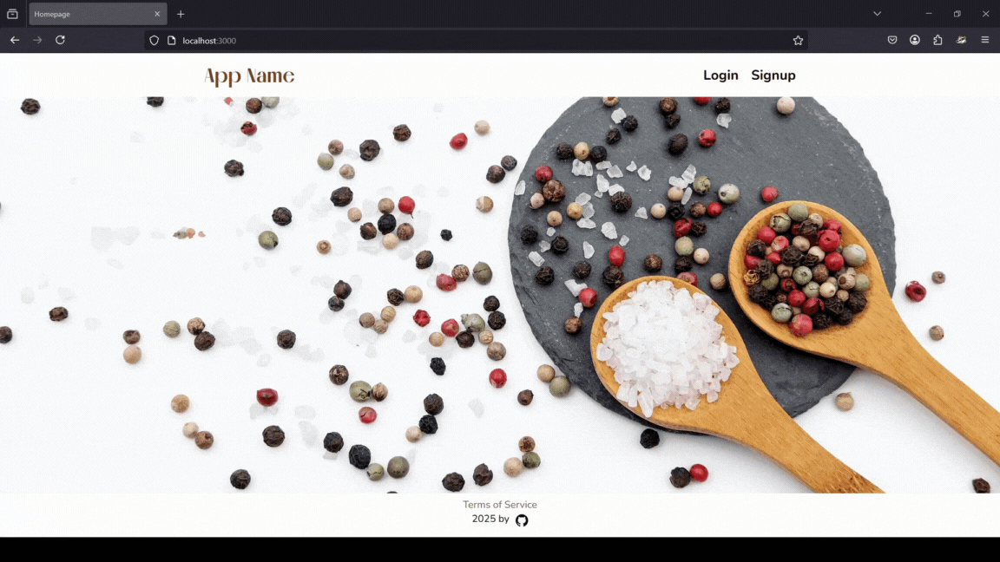
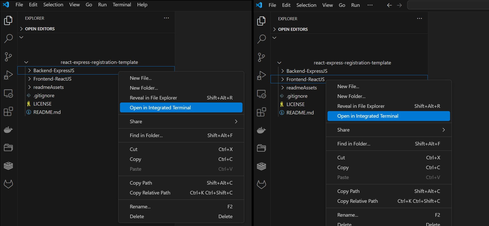
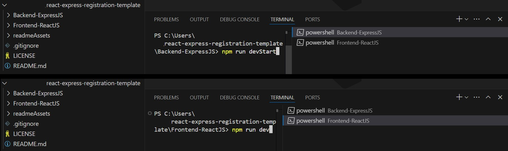
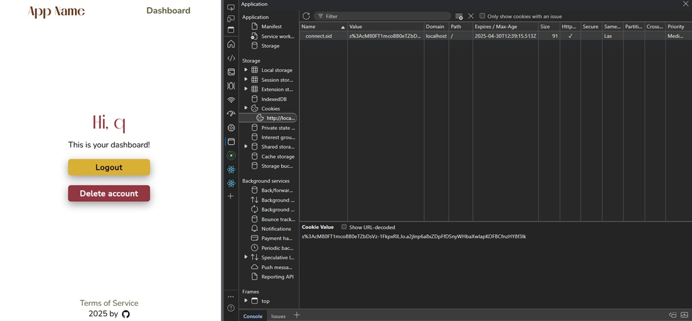

<div align="center">
  <br>
  <h1><b>Fullstack Registration Template</b></h1>
  <strong>Fullstack Auth Template</strong>
</div>
<br>
<table align="center" style="border-collapse:separate;">
  <tr>
    <td style="background: #344955; border-radius:20px; border: 5px solid transparent"><small>Express JS</small></td>
    <td style="background: #344955; border-radius:20px"><small>MongoDB</small></td>
    <td style="background: #344955; border-radius:20px"><small>React JS</small></td>
    <td style="background: #344955; border-radius:20px"><small>Jest JS</small></td>
    <td style="background: #344955; border-radius:20px"><small>Supertest</small></td>
    <td style="background: #344955; border-radius:20px"><small>Postman</small></td>
  </tr>
</table>
<hr>


<hr>

# Table of Contents
- [Introduction](#introduction)
   - [Functionality](#functionality)
   - [Tech Stack and Tools](#tech-stack-and-tools)
- [Installation](#installation)
- [Project Structure and Documentation](#project-structure-and-documentation)
   - [Frontend-ReactJS](#frontend-reactjs)
   - [Backend-ExpressJS](#backend-expressjs)
   - [readmeAssets](#readmeassets)
- [The App](#the-app)
- [Versioning and branches](#versioning-and-branches)
- [About and license](#about-and-license)
<br>

# Introduction

A full-stack boilerplate project featuring user signup, login, session management, and protected routes. Built with **Express.js**, **MongoDB**, and **React.js**.

This monorepo contains separate frontend and backend apps, structured to help you kickstart a fullstack web app with authentication.

The codebase is clean and modular, with a straightforward folder structure and clear documentation, making it easy to build upon and extend with your own features.

## Fuctionality

This project contains the base functionality and styling for:
- Homepage
- Signup page
- Login page
- Dashboard page
- Terms and conditions page
- Logout functionality
- Delete account functionality

## Tech Stack and Tools

**Backend:**

- bcrypt – password hashing
- passport – local authentication strategy
- express-session – session management
- jest, supertest, and mongodb-memory-server – testing

**Frontend:**

- React Router – client-side routing
- Redux Toolkit – state management
- Axios – HTTP requests
- PropTypes – prop validation

**Styling:**

Plain CSS (no frameworks), UI built mobile-first.


# Installation

<details>
   <summary>1. Clone this repository</summary>

   >\
   > More information on how to clone this repository [available here](https://docs.github.com/en/repositories/creating-and-managing-repositories/cloning-a-repository)
   ><br/><br/>
</details>

<details>
   <summary>2. Open the Back-end and Front-end terminals</summary>

   >\
   > If using Visual Studio Code, right-click on each folder and select **Open in Integraded Terminal**.
   > 
   >
   >
   ><br/><br/>
</details>

<details>
   <summary>2. Install dependencies</summary>

   >\
   > Make sure you have MongoDB installed in your machine. If you do not, I recommend using the MongoDB Community Server Download [available here](https://www.mongodb.com/try/download/community). (Date: 24 March 2025). You should also have NodeJS installed.
   > Next, install the app dependencies for both the Back- and Front-end apps.
   >
   > **Backend-ExpressJS**
   > ```pwsh
   >cd Backend-ExpressJS
   >npm install
   >```
   > **Frontend-ReactJS**
   > ```pwsh
   >cd Frontend-ReactJS
   >npm install
   >```
   ><br/><br/>
</details>

<details>
   <summary>3. Create an env file</summary>

   >\
   > You can create a .env file in the root of the `Backend-ExpressJS` folder, the content should be similar to that of the .env.example file provided.
   > 
   > Do not forget to change the session secret key.
   ><br/><br/>
</details>

<details>
   <summary>4. Run both apps</summary>

   >\
   > **Backend-ExpressJS**
   > ```pwsh
   >npm run devStart
   >```
   > **Frontend-ReactJS**
   > ```pwsh
   >npm run dev
   >```
   > 
   >
   > 
   ><br/><br/>
</details>
<br/>

# Project Structure and Documentation

This repo contains both the front- and back-ends of the application, and each app contains its own documentation (`readme.md` files). From the root directory, apart from the `.gitignore` and `LICENSE`, you will find the following folders:

## Frontend-ReactJS

Contains the front-end part of the application.
You can see detailed information about the front-end app [in it's documentation](Frontend-ReactJS/README.md).

## Backend-ExpressJS

Contains the back-end part of the application.
You can see detailed information about the the server and testing [in it's documentation](Backend-ExpressJS/README.md).
The back-end directory also includes a Postman collection, as well as a test file which runs with Jest.

## readmeAssets

Contains the images used in this readme file.

# The template

The apps contains basic registration functionality and placeholder text/image thought to be used as a starter template in other Express + React projects.

It uses server-side cookies (with express-session), manages authorization (using passport), and saves user registration information (with hashed passwords) to a mongoDB database.



# Versioning and branches

This is the project's version 3.

Main difference between this and previous versions:
- react implementation: previous versions used ExpressJS for the UI as well
- routes: new routes implemented
- testing: more test cases included
- documentation: api documentation and postman collections included 

The Version 1 of this project (in Express JS only, with no database, using templates) is available in the branch named `version_1`.

The Version 2 of this project (express JS with mongoDB, using templates, with basic jest testing) is available in the branch named `version_2`.

# About and license

This is the first draft of an app template in React/Express. This draft solely uses Express with ejs templates.

This is a personal project completed by the author, which you are welcome to use and modify at your discretion.

