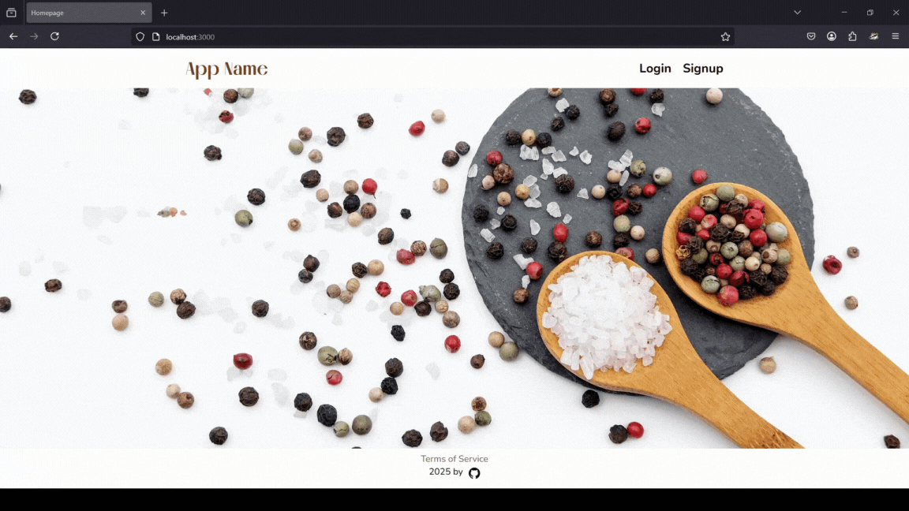

<div align="center">
  <br>
  <h1><b>Express App Registration Template</b></h1>
  <strong>Version 2 (Express JS + MongoDB only)</strong>
</div>
<br>

<hr>


<hr>

# Table of Contents
- [Introduction](#introduction)
- [Installation](#installation)
- [Code and organization](#code-and-organization)
- [The App](#the-app)
- [About and license](#about-and-license)
<br>

# Introduction

A website template with signup and login functionality built solely with Express JS (no database).

This project contains the base functionality and styling for the following pages:
- Homepage
- Signup page
- Login page
- Dashboard page
- Terms and conditions page
- Logout functionality

This project is using the following extensions:
- bcrypt for password hashing
- passport: for authentication (local version)
- express-session: for session management

# Installation

<details>
   <summary>1. Clone this repository</summary>

   >\
   > More information on how to clone this repository [https://docs.github.com/en/repositories/creating-and-managing-repositories/cloning-a-repository](available here)
   ><br/><br/>
</details>

<details>
   <summary>2. Install dependencies</summary>

   >\
   > Make sure you have MongoDB installed in your machine. If you do not, I recommend using the MongoDB Community Server Download [https://www.mongodb.com/try/download/community](available here). (Date: 24 March 2025).
   > Next, install the app dependencies:
   >\
   > ```pwsh
   >npm install
   >```
   ><br/><br/>
</details>

<details>
   <summary>3. Create an env file</summary>

   >\
   > You can create a .env file in the root, the content should be similar to that of the .env.example file provided.
   > 
   > Do not forget to change the session secret key.
   ><br/><br/>
</details>

<details>
   <summary>4. Run the app</summary>

   >\
   > ```pwsh
   >npm run devStart
   >```
   ><br/><br/>
</details>


# Code and organization

This is a small project, with a very straight-forward folder structure.

## Server.js

Is the entry point of the app.
It contains the setup of the application, the middleware functions, and the routes.

## Passport-config.js

Contains the configuration for the 'passport' extension, which handles user authorization.

## Views

The views directory contains the ejs templates used for the UI.
The homepage is in the index.ejs file, while other pages are in the files with their respective names.

It also contains a folder names `partials` with the header and footer templates, which surround the other pages.

The css files are imported in header.ejs.

## Public

The `public` directory contains the following folders:

- css: stylesheet files
- fonts: fonts downloaded from fontshare used for styling
- icons: containing icons used for styling
- images: containing images (including the ones displayed in this README file).

# The App

The app contains basic registration functionality and placeholder text/image thought to be used as a starter template in other Express JS projects.

It uses server-side cookies (with express-session), manages authorization (using passport), and saves user registration information (with hashed passwords) to an array (inside server.js).

When using this project as a template, one should use a database to store user information (adapting the code appropriately).

## Error handling

Very basic server-side error handling was implemented in the forms.


## Mobile version

Simple syting was added, with the attempt to build the app mobile-fist.
This could certainly be improved, especially given the fact no Javascript code was used in the front-end.


# About and license

This is the first draft of an app template in React/Express. This draft solely uses Express with ejs templates.

This is a personal project completed by the author, which you are welcome to use and modify at your discretion.

This project's base skeleton express functionality was based on a web tutorial from Kyle's Web Dev Simplified video [https://www.youtube.com/watch?v=-RCnNyD0L-s](available here). Apart from the styling, this project also differs from the video in the routes, error handling, error display (it does not use flash), the logout logic, adjustments to the session management, adjustments to template structure, among others. The video, however, contains a good starting point for beginners learning Express.js and this project could be considered an improvement on the end result of the video.

For learners and Node.js beginners, I could also recommend another video from Programming with Mosh [https://www.youtube.com/watch?v=TlB_eWDSMt4&t=1049s](available here).


